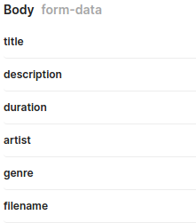

# roketin


## POST localhost:8080/api/v1/create
**Body**


**Response** 
```json
{
    "message": "Insert Success",
    "code": 200,
    "status": "success",
    "data": {
        "title": "asdfasdf",
        "description": "",
        "duration": "sdfasfg",
        "artist": "asdfasdf",
        "genre": "dfhsdfdg",
        "filename": "video/1f1d26b34700053b7518.mp4"
    }
}
```

